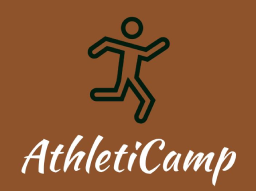

# Athleti Camp Website - Client-Side

Welcome to the client-side repository of the Athleti Camp website! This project is a summer camp-based sports school that offers various sports training programs. The website is built using the MERN stack (MongoDB, Express.js, React.js, Node.js), with React Router for navigation. The UI is styled using Tailwind CSS, and several packages and technologies have been utilized to enhance the user experience.

## Project Features

1. **Multi-Sport Training Programs**: Athleti Camp offers a wide range of sports training programs for children and teenagers. Whether it's soccer, basketball, tennis, swimming, or any other sport, our camp provides expert coaching and facilities for all enthusiasts.

2. **Responsive Design**: The website is designed to be fully responsive, ensuring optimal viewing and interaction across various devices and screen sizes. Users can access the site seamlessly from their desktops, laptops, tablets, or smartphones.

3. **Animated User Interface**: To create engaging and visually appealing user experiences, the project incorporates the Anime.js library. This enables smooth animations and transitions throughout the website, enhancing the overall aesthetics.

4. **Registration and Enrollment**: The website features a registration and enrollment system implemented using React Hook Form. Users can easily fill out and submit their details, select their preferred sports programs, and complete the enrollment process hassle-free.

5. **Real-time Updates and Notifications**: Firebase, a real-time database service, is integrated into the project to provide instant updates and notifications to users. They can stay informed about important announcements, schedule changes, and other camp-related information.

## Used Packages/Technologies

- React.js: A JavaScript library for building user interfaces.
- React Router: A routing library for React applications.
- MongoDB: A NoSQL database for storing and retrieving data.
- Tailwind CSS: A utility-first CSS framework for rapid UI development.
- Anime.js: A lightweight JavaScript animation library for creating smooth animations.
- Firebase: A real-time database and cloud messaging service for web applications.
- React Hook Form: A library for building performant and flexible forms in React.
- React Spring: A library for creating smooth, fluid animations in React applications.

## Live Site

The live version of the Athleti Camp website can be accessed at .

Feel free to explore the website and enroll in your favorite sports programs. If you have any questions or feedback, please don't hesitate to contact our support team. We hope you have a fantastic experience at Athleti Camp!
